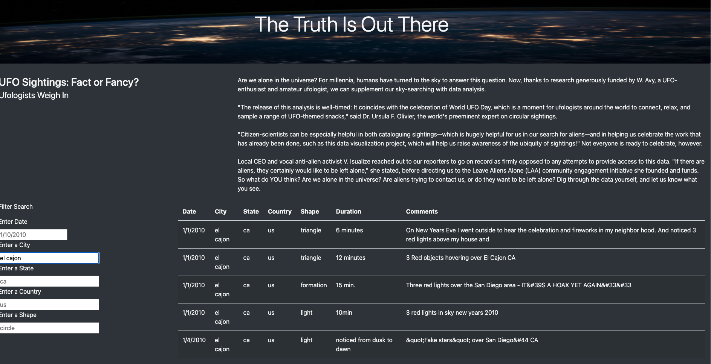
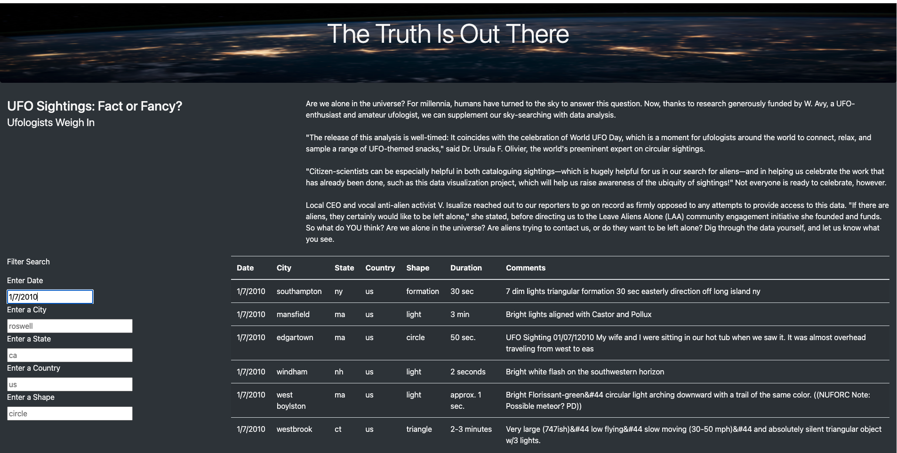

## UFOs
### Overview:

#### We build a table to organize UFO data stored in a JavaScript array and created filters to make this table fully dynamic, meaning react to user input, and then placed the table into an HTML file for easy viewing. Finally we used Bootstrap to customize the webpage. 

#### Dana’s webpage and dynamic table are working with the date filter. But she’d like to provide a more in-depth analysis of UFO sightings by allowing users to filter for multiple criteria at the same time. In addition to the date, we added table filters for the city, state, country, and shape.

### Results:

#### You type the date in the following format 1/1/2010 and press enter. 
#### - This d3.selectAll("input") when an criteria is entered in the search box and the enter key is pressed  d3.selectAll("input").on("change", updateFilters);
#### - This inturn makes a call to the updateFilters function
#### - Inside the update filters, we will update the js. data with the criteria entered by the user.
#### - We use this filtered table to make a call to the build table which matches the user entered criteria.
#### - Then we use Bootstrap in html to display this information on our webpage.

### Summary:
### One drawback of this webpage
#### - The filter button needs to be activated. So just clicking the filter button once should search for any/all user input.
#### - The table can be displayed with a scoll button for ease of manuvering the page.

### Two additional recommendations for further development
#### - Right now the input fields are case-sensitive. So "El Cajon" will not be recognized. So we need to update our code to be case in-sensivtive.
#### - A drop down menu for Country, States within the country. And drop down for expected 'Shapes' input.

